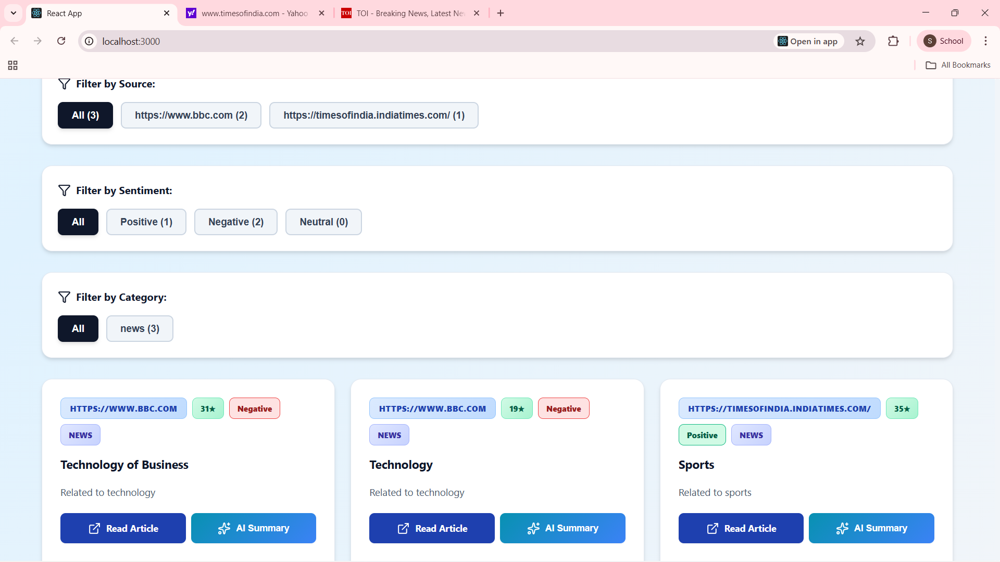
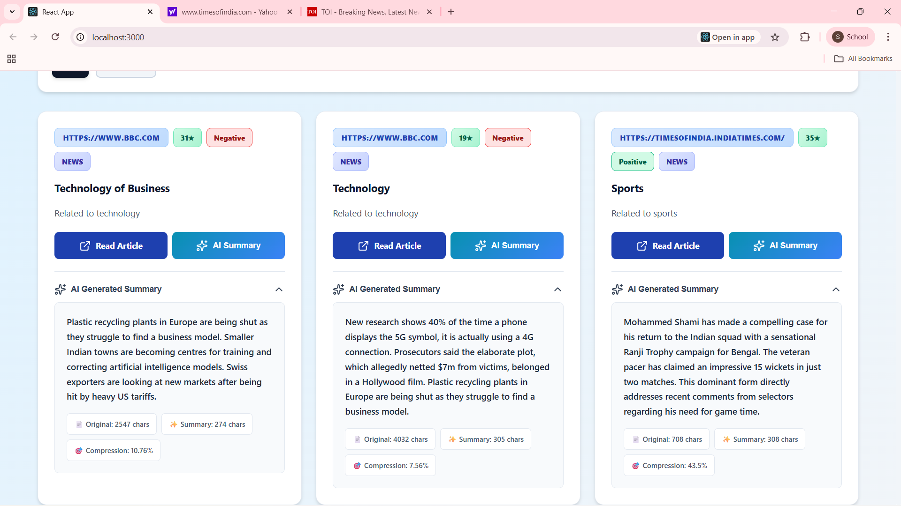
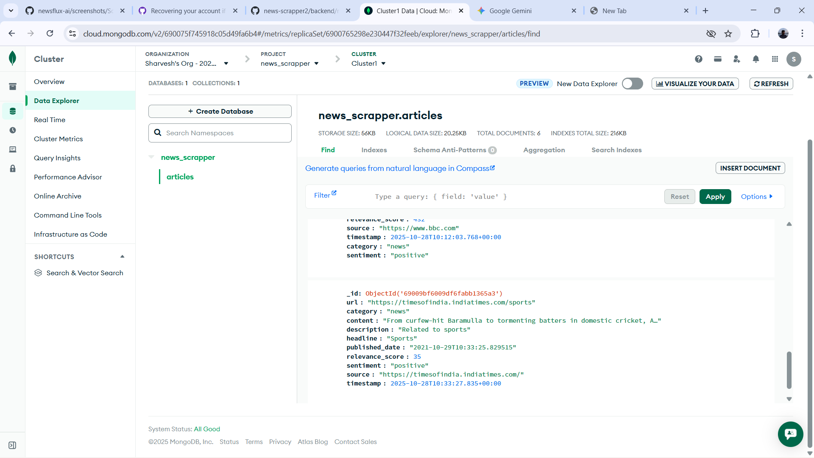

# ⚡ NewsFlux AI

### 🧠 Intelligent News Aggregation • Real-time Scraping • AI-Powered Insights

**NewsFlux AI** is an intelligent **news aggregation and summarization platform** that scrapes articles from multiple sources in real time, classifies them into relevant **categories (Business, Tech, etc.)**, and performs **sentiment analysis** (Positive, Negative, Neutral).  
It’s built for **fast insights, visual analytics, and modern UI design**.

---

## 🚀 Features

- 🌐 **Multi-source Scraping** – Fetch articles from various news websites (BBC, CNN, etc.)
- 🧠 **Category Classification** – Automatically tags articles as Business, Technology, Sports, etc.
- 💬 **Sentiment Analysis** – Detects whether an article is Positive, Negative, or Neutral
- 🧩 **AI Summarization** – Generates short summaries using lightweight NLP logic
- 📊 **Interactive Dashboard** – Real-time charts for article count and sentiment distribution
- 💎 **Modern UI/UX** – Built with React + Tailwind for smooth experience
- ⚙️ **FastAPI Backend** – Handles scraping, analysis, and MongoDB integration

---

## 🖥️ Tech Stack

| Layer | Technology |
|-------|-------------|
| **Frontend** | React.js (Vite / CRA), Tailwind CSS, Chart.js |
| **Backend** | FastAPI (Python) |
| **Database** | MongoDB |
| **NLP** | TextBlob (for sentiment), keyword-based category detection |
| **Styling** | Tailwind CSS, Flexbox, Gradients |

---

## 🧩 Data Architecture

The **NewsFlux AI** architecture is designed for **real-time scraping, intelligent processing, and interactive visualization** using a modular FastAPI–React–MongoDB pipeline.

### 🏗️ System Workflow

1. **📰 Web Scraping Layer**
   - Fetches live news articles from multiple reliable sources (BBC, CNN, TechCrunch, etc.)
   - Extracts metadata — *title, description, source, timestamp, and content*
   - Stores raw JSON data temporarily before processing

2. **🤖 AI Processing Layer (Backend - FastAPI)**
   - **Category Classification** – Detects article topics (e.g., Business, Technology, Sports)
   - **Sentiment Analysis** – Uses TextBlob to determine Positive, Negative, or Neutral tone
   - **AI Summarization** – Generates concise summaries for each article
   - **Data Cleaning** – Removes duplicates and invalid records before database storage

3. **🗄️ Data Storage Layer (MongoDB)**
   - Stores structured article data in JSON format:
     ```json
     {
       "headline": "Technology of Business",
       "description": "Latest tech trends and insights",
       "source": "BBC",
       "timestamp": "2025-10-28T14:30:00Z",
       "category": "Technology",
       "sentiment": "Positive",
       "summary": "AI-driven automation is transforming industries."
     }
     ```
   - Enables efficient **filtering and search** based on category, sentiment, or date.

4. **📊 Visualization Layer (Frontend - React)**
   - Fetches processed data through FastAPI endpoints
   - Displays **sentiment distribution and category-wise analytics** using interactive charts
   - Provides **filtering** by sentiment and category
   - Offers **AI Summarization View** for quick insights into trending topics

5. **🔍 Intelligent Search & Query**
   - Instead of predefined APIs, users can **search specific topics directly** from their preferred news sources.
   - This approach reduces model complexity while allowing **real-time query and comparison**.


## 📷 Demo Screenshots

### 🏠 1. Dashboard View  
Shows overall sentiment, total articles, and recent updates.  


### ✏️ 2. Input / Search Interface  
Allows searching and fetching live articles from multiple news sources.  


### 📊 3. Data Visualization  
Displays interactive charts for category and sentiment analysis.  


### 🗂️ 4. Filtered Data View  
Scraped articles can be filtered by **category** and **sentiment**.  


### 🤖 5. AI Summarization  
Shows concise AI-generated summaries for each article.  


### 💾 6. Data Storage (MongoDB)  
Structured article data is stored in MongoDB for persistence and querying.  


### ⚡ 7. Trending News (Real-Time Updates)
The system continuously fetches and displays trending or breaking news based on live data analysis and keyword frequency.  


--
## ⚙️ How to Run the Project Locally

### 🧩 Backend (FastAPI)
```bash
cd backend
cd news_env
pip install -r requirements.txt
uvicorn main:app --reload

--
Frontend:
# Install dependencies (you can use either)
npm install
# or
pnpm install
npm start
# or
pnpm start


