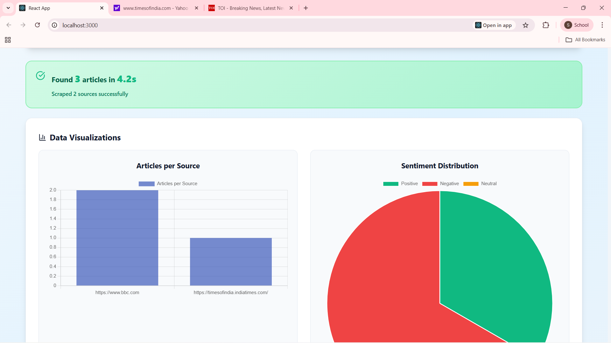

# ⚡ NewsFlux AI

### 🧠 Intelligent News Aggregation • Real-time Scraping • AI-Powered Insights

NewsFlux AI is an intelligent **news aggregation and summarization platform** that scrapes articles from multiple sources in real time, classifies them into relevant **categories (Business, Tech, etc.)**, and performs **sentiment analysis** (Positive, Negative, Neutral).  
It’s built for fast insights, visual analytics, and modern UI design.

---

## 🚀 Features

- 🌐 **Multi-source Scraping** – Fetch articles from various news websites (BBC, CNN, etc.)
- 🧠 **Category Classification** – Automatically tags articles as Business, Technology, Sports, etc.
- 💬 **Sentiment Analysis** – Detects whether an article is Positive, Negative, or Neutral
- 🧩 **AI Summarization** – Generates quick article summaries using lightweight NLP logic
- 📊 **Interactive Dashboard** – Real-time charts for article count and sentiment distribution
- 💎 **Modern UI/UX** – Built with React + Tailwind for smooth experience
- ⚙️ **FastAPI Backend** – Handles scraping, analysis, and MongoDB integration

---

## 🖥️ Tech Stack

| Layer | Technology |
|-------|-------------|
| Frontend | React.js (Vite / CRA), Inline CSS Styling, Chart.js |
| Backend | FastAPI (Python) |
| Database | MongoDB |
| NLP | TextBlob (for sentiment), keyword-based category detection |
| Styling | Tailwind CSS, Flexbox, Gradients |

---

## 📷 Demo Screenshots

### 🏠 Dashboard View


### 📊 Visualization & Sentiment Charts


### 📰 Filtered Articles with Category & Sentiment Tags


> 📁 Place your screenshots inside a folder named `/screenshots` in your project root.  
> Rename the three uploaded images as `1.png`, `2.png`, and `3.png` for proper linking.

---

## ⚙️ How to Run the Project Locally

### 🧩 Backend (FastAPI)
```bash
cd backend
pip install -r requirements.txt
uvicorn main:app --reload
